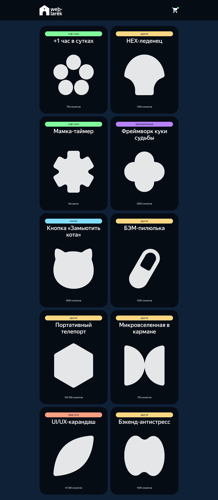

https://github.com/MikeBeloborodov/web-larek-frontend

# Проектная работа "Веб-ларек"

## Оглавление

- [Запуск](#запуск)
- [Сборка](#сборка)
- [Описание](#описание)
- [Скриншоты](#скриншоты)
- [Документация](#документация)
- [Автор](#автор)
- [Благодарность](#благодарность)

## Запуск

Для установки и запуска проекта необходимо выполнить команды

```
npm install
npm run start
```

или

```
yarn
yarn start
```

## Сборка

```
npm run build
```

или

```
yarn build
```

## Описание

Онлайн магазин необходимых для веб разработчика мелочей.

Стек: HTML, SCSS, TS, Webpack

Структура проекта:

- src/ — исходные файлы проекта
- src/components/ — папка с JS компонентами
- src/components/base/ — папка с базовым кодом

Важные файлы:

- src/pages/index.html — HTML-файл главной страницы
- src/types/index.ts — файл с типами
- src/index.ts — точка входа приложения
- src/styles/styles.scss — корневой файл стилей
- src/utils/constants.ts — файл с константами
- src/utils/utils.ts — файл с утилитами

## Скриншоты



## Документация

### Типы данных

```TypeScript
// Описывает категории товаров
type CategoryType = 
  | 'другое'
  | 'софт-скил'
  | 'дополнительное'
  | 'кнопка'
  | 'хард-скил';

// Связывает категории товаров и CSS селектор
type CategoryMapping = {
  [Key in CategoryType]: string;
};

// Ошибки формы
type FormErrors = Partial<Record<keyof IOrderForm, string>>;

// Ответ сервера
interface ApiResponse {
  items: IProduct[];
}

// Интерфейс продукта
interface IProduct {
  id: string;
  description: string;
  image: string;
  title: string;
  category: CategoryType;
  price: number | null;
  selected: boolean;
}

// Интерфейс заказа
interface IOrder {
  items: string[];
  payment?: string;
  total: number | null;
  address: string;
  email: string;
  phone: string;
}

// Интерфейс формы заказа
interface IOrderForm {
  payment?: string;
  address: string;
  email: string;
  phone: string;
}

// Интерфейс состояния приложния
interface IAppState {
  basket: string[];
  store: Product[];
  order: IOrder | null;
  loading: boolean;
}

// Тип имени события
type EventName = string | RegExp;
// Тип подписчика
type Subscriber = Function;
// Тип события
type EmitterEvent = {
  eventName: string,
  data: unknown
};

// Интерфейс для класса EventEmitter
interface IEvents {
  on<T extends object>(event: EventName, callback: (data: T) => void): void;
  emit<T extends object>(event: string, data?: T): void;
  trigger<T extends object>(
    event: string,
    context?: Partial<T>
  ): (data: T) => void;
}

// Интерфейс для состояния формы
interface IFormState {
  valid: boolean;
  errors: string[];
}

// Интерфейс для модального окна
interface IModalData {
  content: HTMLElement;
}

// Интерфейс для страницы
interface IPage {
  counter: number;
  store: HTMLElement[];
  locked: boolean;
}

// Интерфейс для отображения товара в корзине
interface IProductBasket extends IProduct {
  id: string;
  index: number;
}

// Интерфейс карточки
interface ICard {
  id: string;
  title: string;
  category: string;
  description: string;
  image: string;
  price: number | null;
}

// Интерфейс для контактов
interface IContacts {
  phone: string;
  email: string;
}

// Интерфейс для заказа
interface IOrder {
  address: string;
  payment: string;
}

// Интерфейс для корзины
interface IBasket {
  list: HTMLElement[];
  price: number;
}

// Интерфейс для отображения успешной оплаты
interface ISuccess {
  description: number;
}

```

### Модели данных

```TypeScript
/**
 * Базовый компонент
 */
abstract class Component<T> {
  protected constructor(protected readonly container: HTMLElement) { }
  toggleClass(element: HTMLElement, className: string, force?: boolean): void {}
  protected setText(element: HTMLElement, value: string): void {}
  setDisabled(element: HTMLElement, state: boolean): void {}
  protected setHidden(element: HTMLElement): void {}
  protected setVisible(element: HTMLElement): void {}
  protected setImage(el: HTMLImageElement, src: string, alt?: string): void {}
  render(data?: Partial<T>): HTMLElement {}
}

/**
 * Базовая модель, чтобы можно было отличить ее от простых объектов с данными
 */
abstract class Model<T> {
  constructor(data: Partial<T>, protected events: IEvents) {}
  emitChanges(event: string, payload?: object) {}
}

/**
 * Класс для работы с Api
 */
class Api {
  readonly baseUrl: string;
  protected options: RequestInit;
  constructor(baseUrl: string, options: RequestInit = {}) {}
  protected async handleResponse(response: Response): Promise<Partial<object>> {}
  async get(uri: string) {}
  async post(uri: string, data: object) {}
}

/**
 * Обработчик событий
 */
class EventEmitter implements IEvents {
  _events: Map<EventName, Set<Subscriber>>;
  constructor() {}
  on<T extends object>(eventName: EventName, callback: (event: T) => void) {}
  off(eventName: EventName, callback: Subscriber) {}
  emit<T extends object>(eventName: string, data?: T) {}
  onAll(callback: (event: EmitterEvent) => void) {}
  offAll() {}
  trigger<T extends object>(eventName: string, context?: Partial<T>) {}
}

/**
 * Класс для HTML формы
 */
class Form<T> extends Component<IFormState> {
  protected _submit: HTMLButtonElement;
  protected _errors: HTMLElement;
  constructor(protected container: HTMLFormElement, protected events: IEvents) {}
  protected onInputChange(field: keyof T, value: string) {}
  set valid(value: boolean) {}
  set errors(value: string) {}
  render(state: Partial<T> & IFormState) {}
}

/**
 * Класс для модального окна
 */
class Modal extends Component<IModalData> {
  protected _closeButton: HTMLButtonElement;
  protected _content: HTMLElement;
  constructor(container: HTMLElement, protected events: IEvents) {}
  set content(value: HTMLElement) {}
  open() {}
  close() {}
  render(data: IModalData): HTMLElement {}
}

/**
 * Класс для продукта в магазине
 */
class Product extends Model<IProduct> {
  id: string;
  description: string;
  image: string;
  title: string;
  category: string;
  price: number | null;
  selected: boolean;
}

/**
 * Класс для состояния приложения
 */
class AppState extends Model<IAppState> {
  basket: Product[];
  store: Product[];
  loading: boolean;
  order: IOrder;
  formErrors: FormErrors = {};
  addToBasket(value: Product) {}
  deleteFromBasket(id: string) {}
  clearBasket() {}
  setBasket() {}
  getTotal() {}
  setItems() {}
  setOrderField(field: keyof IOrderForm, value: string) {}
  validateContacts() {}
  validateOrder() {}
  refreshOrder() {}
  getTotalBasketPrice() {}
  setStore(items: IProduct[]) {}
}

/**
 * Класс для страницы
 */
class Page extends Component<IPage> {
  protected _counter: HTMLElement;
  protected _store: HTMLElement;
  protected _wrapper: HTMLElement;
  protected _basket: HTMLElement;
  constructor(container: HTMLElement, protected events: IEvents) {}
  set counter(value: number) {}
  set store(items: HTMLElement[]) {}
  set locked(value: boolean) {}
}

/**
 * Класс для корзины
 */
class Basket extends Component<IBasket> {
  protected _list: HTMLElement;
  protected _price: HTMLElement;
  protected _button: HTMLButtonElement;
  constructor(protected blockName: string, container: HTMLElement, protected events: IEvents) {}
  set price(price: number) {}
  set list(items: HTMLElement[]) {}
  refreshIndices() {}
}

/**
 * Класс для товара в корзине
 */
class StoreItemBasket extends Component<IProductBasket> {
  protected _index: HTMLElement;
  protected _title: HTMLElement;
  protected _price: HTMLElement;
  protected _button: HTMLButtonElement;
  constructor(protected blockName: string, container: HTMLElement, actions?: IStoreItemBasketActions) {}
  set title(value: string) {}
  set index(value: number) {}
  set price(value: number) {}
}

/**
 * Класс для карточки
 */
class Card extends Component<ICard> {
  protected _title: HTMLElement;
  protected _image: HTMLImageElement;
  protected _category: HTMLElement;
  protected _price: HTMLElement;
  protected _button: HTMLButtonElement;
  constructor(protected blockName: string, container: HTMLElement, actions?: ICardActions) {}
  set id(value: string) {}
  get id(): string {}
  set title(value: string) {}
  get title(): string {}
  set image(value: string) {}
  set price(value: number | null) {}
  set selected(value: boolean) {}
  set category(value: CategoryType) {}
}

/**
 * Класс для карточки на главной странице
 */
class StoreItem extends Card {
  constructor(container: HTMLElement, actions?: ICardActions) {}
}

/**
 * Класс для карточки в превью
 */
class StoreItemPreview extends Card {
  protected _description: HTMLElement;
  constructor(container: HTMLElement, actions?: ICardActions) {}
  set description(value: string) {}
}

/**
 * Класс для окошка для заполнения контактов
 */
class Contacts extends Form<IContacts> {
  constructor(container: HTMLFormElement, events: IEvents) {}
  set phone(value: string) {}
  set email(value: string) {}
}

/**
 * Класс для окошка заказа
 */
class Order extends Form<IOrder> {
  protected _card: HTMLButtonElement;
  protected _cash: HTMLButtonElement;
  constructor(protected blockName: string, container: HTMLFormElement, protected events: IEvents) {}
  set address(value: string) {}
  disableButtons() {}
}

/**
 * Класс для окошка успешной оплаты
 */
class Success extends Component<ISuccess> {
  protected _button: HTMLButtonElement;
  protected _description: HTMLElement;
  constructor(protected blockName: string, container: HTMLElement, actions?: ISuccessActions) {}
  set description(value: number) {}
}
```

### Описание событий

```TypeScript
// Изменились элементы каталога
events.on('items:changed', () => {});

// Открытие карточки
events.on('card:select', (item: Product) => {});

// Открытие корзины
events.on('basket:open', () => {});

// Оформить заказ
events.on('basket:order', () => {});

// Изменилось состояние валидации заказа
events.on('orderFormErrors:change', (errors: Partial<IOrderForm>) => {});

// Изменилось состояние валидации контактов
events.on('contactsFormErrors:change', (errors: Partial<IOrderForm>) => {});

// Изменились введенные данные
events.on('orderInput:change', (data: { field: keyof IOrderForm, value: string }) => {});

// Заполнить телефон и почту
events.on('order:submit', () => {})

// Покупка товаров
events.on('contacts:submit', () => {})

// Окно успешной покупки
events.on('order:success', (res: ApiListResponse<string>) => {})

// Закрытие модального окна
events.on('modal:close', () => {});
```

## Автор

- Github - [MikeBeloborodov](https://github.com/MikeBeloborodov)
- Frontend Mentor - [@MikeBeloborodov](https://www.frontendmentor.io/profile/MikeBeloborodov)

## Благодарность

Благодарю команду Яндекс Практикум за предоставление дизайна и уроков!
